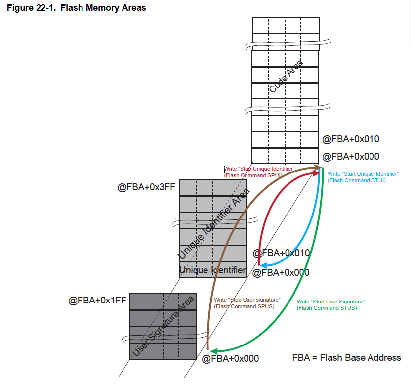
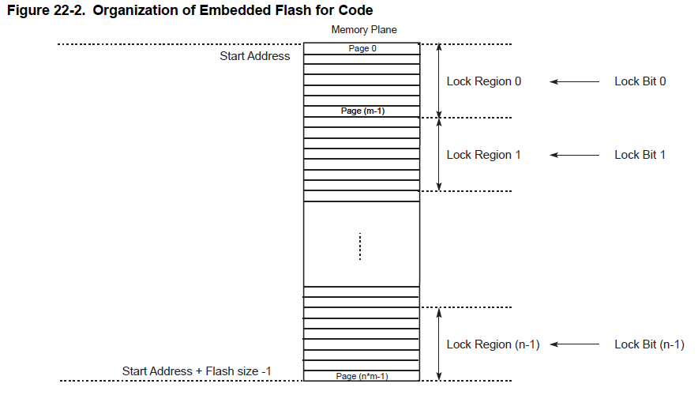

---

typora-root-url: ..\img
typora-copy-images-to: ..\img
---

# 22. Enhanced Embedded Flash Controller (EEFC)

## 22.1 描述

EEFC (Enhanced Embedded Flash Controller)提供Flash块与32位内部总线的接口。

它的128位宽内存接口提高了性能。它还使用一套完整的命令来管理Flash的编程、擦除、锁定和解锁序列。其中一个命令返回嵌入式Flash描述符定义，该定义通知系统有关Flash组织的信息，从而使软件成为通用的。

## 22.2 特性

- 在Thumb-2模式下增加性能，128位宽内存接口高达150 MHz
- 代码循环优化
- 128位锁位，每个锁位保护一个锁域
- 9个通用GPNVM位
- 一个接一个的锁位编程
- 关键字保护的命令
- 删除整个Flash
- 按扇区删除
- 按页删除
- 提供唯一标识符
- 提供512字节的用户签名区
- 支持在编程前擦除
- 锁定和解锁操作
- ECC单和多错误标志报告
- 支持读取校准位
- 注册写保护

## 22.3 Product Dependencies

### 22.3.1 Power Management

增强嵌入式Flash控制器(EEFC)是连续时钟驱动。电源管理控制器PMC对其行为没有影响。

### 22.3.2 Interrupt Sources

EEFC中断线已连接到中断控制器。使用EEFC中断需要先编写中断控制器。只有当EEFC_FMR.FRDY值为时，才会产生EEFC中断。

## 22.4 Functional Description

### 22.4.1 Embedded Flash Organization

嵌入式Flash与内部总线相连。由以下部分组成:

- code区大小相同的几个page组成的一个memory plane；
- 一个单独的2 x 512字节的内存区域，包括唯一的芯片标识符。
- 用于用户签名的单独512字节内存区域。
- 两个用于代码读优化的128位读缓冲区。
- 一个用于数据读优化的128位读缓冲区。
- 一个写缓冲区，用于管理page编程。写缓冲区与page大小相等。这个缓冲区是只写的，并且在整个闪存地址空间中都是可访问的，因此每个字都可以写到它的最终地址。
- 几个锁位用于保护多个page上的写/擦除操作(锁区)。锁位与memory plane中由若干page组成的锁区域相关联。
- 可以通过EEFC接口设置和清除的几个位，称为通用非易失性内存位(GPNVM bits)。

嵌入式Flash大小、页面大小、锁区域的组织和GPNVM位的定义都是特定于设备的。在应用程序发出“获取Flash描述符”命令后，EEFC返回Flash控制器的描述符，请参见“获取Flash描述符命令”。

