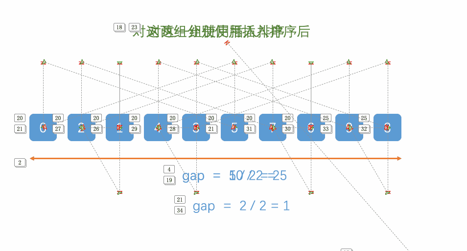
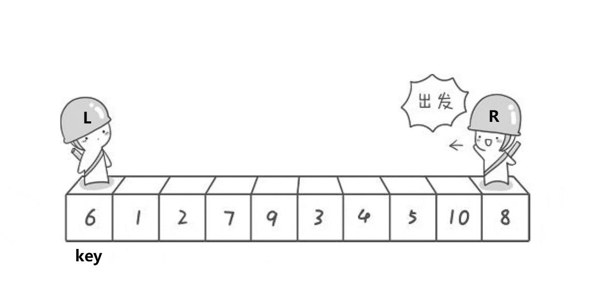
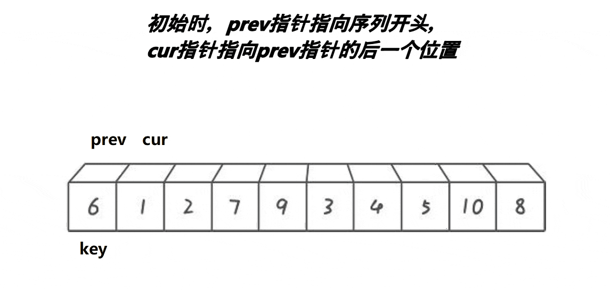

本次内容大纲：


注：下列八大排序的代码均以排升序为例。

# 直接插入排序

动图演示：


 插入排序，又叫直接插入排序。实际中，我们玩扑克牌的时候，就用了插入排序的思想。
基本思想：
 在待排序的元素中，假设前n-1个元素已有序，现将第n个元素插入到前面已经排好的序列中，使得前n个元素有序。按照此法对所有元素进行插入，直到整个序列有序。

 但我们并不能确定待排元素中究竟哪一部分是有序的，所以我们一开始只能认为第一个元素是有序的，依次将其后面的元素插入到这个有序序列中来，直到整个序列有序为止。

代码：

```c
//插入排序
void InsertSort(int* a, int n)
{
	int i = 0;
	for (i = 0; i < n - 1; i++)
	{
		int end = i;//记录有序序列的最后一个元素的下标
		int tmp = a[end + 1];//待插入的元素
		while (end >= 0)
		{
			if (tmp < a[end])//还需继续比较
			{
				a[end + 1] = a[end];
				end--;
			}
			else//找到应插入的位置
			{
				break;
			}
		}
		a[end + 1] = tmp;
		//代码执行到此位置有两种情况:
		//1.待插入元素找到应插入位置（break跳出循环到此）。
		//2.待插入元素比当前有序序列中的所有元素都小（while循环结束后到此）。
	}
}
```

时间复杂度：O(N^2^)  空间复杂度：O(1) 

# 希尔排序

动图演示：



 希尔排序是按其设计者希尔的名字命名的，该算法由希尔1959年公布。希尔可以说是一个脑洞非常大的人，他对普通插入排序的时间复杂度进行分析，得出了以下结论：
 1.普通插入排序的时间复杂度最坏情况下为O(N^2^)，此时待排序列为逆序，或者说接近逆序。
 2.普通插入排序的时间复杂度最好情况下为O(N)，此时待排序列为升序，或者说接近升序。

于是希尔就想：若是能先将待排序列进行一次预排序，使待排序列接近有序（接近我们想要的顺序），然后再对该序列进行一次直接插入排序。因为此时直接插入排序的时间复杂度为O(N)，那么只要控制预排序阶段的时间复杂度不超过O(N^2^)，那么整体的时间复杂度就比直接插入排序的时间复杂度低了。


希尔排序，又称缩小增量法。其基本思想是：
 1.先选定一个小于N的整数gap作为第一增量，然后将所有距离为gap的元素分在同一组，并对每一组的元素进行直接插入排序。然后再取一个比第一增量小的整数作为第二增量，重复上述操作…
 2.当增量的大小减到1时，就相当于整个序列被分到一组，进行一次直接插入排序，排序完成。

问题：为什么要让gap由大到小呢？
answer：gap越大，数据挪动得越快；gap越小，数据挪动得越慢。前期让gap较大，可以让数据更快得移动到自己对应的位置附近，减少挪动次数。

注：一般情况下，取序列的一半作为增量，然后依次减半，直到增量为1（也可自己设置）。

举个例子分析一下：
 现在我们用希尔排序对该序列进行排序。


 我们用序列长度的一半作为第一次排序时gap的值，此时相隔距离为5的元素被分为一组（共分了5组，每组有2个元素），然后分别对每一组进行直接插入排序。


 gap的值折半，此时相隔距离为2的元素被分为一组（共分了2组，每组有5个元素），然后再分别对每一组进行直接插入排序。


 gap的值再次减半，此时gap减为1，即整个序列被分为一组，进行一次直接插入排序。


 该题中，前两趟就是希尔排序的预排序，最后一趟就是希尔排序的直接插入排序。

代码：

```c
//希尔排序
void ShellSort(int* a, int n)
{
	int gap = n;
	while (gap > 1)
	{
		gap = gap / 2;//gap折半
		int i = 0;
		//进行一趟排序
		for (i = 0; i < n - gap; i++)
		{
			int end = i;
			int tmp = a[end + gap];
			while (end >= 0)
			{
				if (tmp < a[end])
				{
					a[end + gap] = a[end];
					end -= gap;
				}
				else
				{
					break;
				}
			}
			a[end + gap] = tmp;
		}
	}
}
```


时间复杂度：O(NlogN)  空间复杂度：O(1)

平均时间复杂度：O(N^1.3^)

# 选择排序

动图演示：


 选择排序，即每次从待排序列中选出一个最小值，然后放在序列的起始位置，直到全部待排数据排完即可。

代码：

```c
//选择排序(一次选一个数)
void SelectSort(int* a, int n)
{
	int i = 0;
	for (i = 0; i < n; i++)//i代表参与该趟选择排序的第一个元素的下标
	{
		int start = i;
		int min = start;//记录最小元素的下标
		while (start < n)
		{
			if (a[start] < a[min])
				min = start;//最小值的下标更新
			start++;
		}
		Swap(&a[i], &a[min]);//最小值与参与该趟选择排序的第一个元素交换位置
	}
}
```


时间复杂度：O(N^2^)       空间复杂度：O(1)

 实际上，我们可以一趟选出两个值，一个最大值一个最小值，然后将其放在序列开头和末尾，这样可以使选择排序的效率快一倍。

代码：

```c
//选择排序(一次选两个数)
void SelectSort(int* a, int n)
{
	int left = 0;//记录参与该趟选择排序的第一个元素的下标
	int right = n - 1;//记录参与该趟选择排序的最后一个元素的下标
	while (left < right)
	{
		int minIndex = left;//记录最小元素的下标
		int maxIndex = left;//记录最大元素的下标
		int i = 0;
		//找出最大值及最小值的下标
		for (i = left; i <= right; i++)
		{
			if (a[i] < a[minIndex])
				minIndex = i;
			if (a[i]>a[maxIndex])
				maxIndex = i;
		}
		//将最大值和最小值放在序列开头和末尾
		Swap(&a[minIndex], &a[left]);
		if (left == maxIndex)
		{
			maxIndex = minIndex;//防止最大值位于序列开头，被最小值交换
		}
		Swap(&a[maxIndex], &a[right]);
		left++;
		right--;
	}
}
```


时间复杂度：O(N^2^) 空间复杂度：O(1)

# 堆排序

 要学习堆排序，首先要学习堆的向下调整算法，因为要用堆排序，你首先得建堆，而建堆需要执行多次堆的向下调整算法。

堆的向下调整算法（使用前提）：
 若想将其调整为小堆，那么根结点的左右子树必须都为小堆。
 若想将其调整为大堆，那么根结点的左右子树必须都为大堆。


向下调整算法的基本思想（以建大堆为例）：
 1.从根结点处开始，选出左右孩子中值较大的孩子。
 2.让大的孩子与其父亲进行比较。
 若大的孩子比父亲还大，则该孩子与其父亲的位置进行交换。并将原来大的孩子的位置当成父亲继续向下进行调整，直到调整到叶子结点为止。
 若大的孩子比父亲小，则不需处理了，调整完成，整个树已经是大堆了。

图片示例：


堆的向下调整算法代码：

```c
//堆的向下调整算法
void AdjustDown(int* a, int n, int root)
{
	int parent = root;
	int child = 2 * parent + 1;//假设左孩子较大
	while (child < n)
	{
		if (child + 1 < n&&a[child + 1] > a[child])//右孩子存在，并且比左孩子大
		{
			child++;//左右孩子的较大值
		}
		if (a[child] > a[parent])
		{
			Swap(&a[child], &a[parent]);
			parent = child;
			child = 2 * parent + 1;
		}
		else//已成堆
		{
			break;
		}
	}
}
```


 使用堆的向下调整算法，最坏的情况下（即一直需要交换结点），需要循环的次数为：h - 1次（h为树的高度）。而h = log2(N+1)（N为树的总结点数）。所以堆的向下调整算法的时间复杂度为：O(logN) 。

 上面说到，使用堆的向下调整算法需要满足其根结点的左右子树均为大堆或是小堆才行，那么如何才能将一个任意树调整为堆呢？
 答案很简单，我们只需要从倒数第一个非叶子结点开始，从后往前，按下标，依次作为根去向下调整即可。


建堆代码：

	//建堆
	for (int i = (n - 1 - 1) / 2; i >= 0; i--)
	{
		AdjustDown(php->a, php->size, i);
	}
那么建堆的时间复杂度又是多少呢？
 当结点数无穷大时，完全二叉树与其层数相同的满二叉树相比较来说，它们相差的结点数可以忽略不计，所以计算时间复杂度的时候我们可以将完全二叉树看作与其层数相同的满二叉树来进行计算。


我们计算建堆过程中总共交换的次数：
T ( n ) = 1 × ( h − 1 ) + 2 × ( h − 2 ) + . . . + 2^h−3^ × 2 + 2^h−2^ × 1 
两边同时乘2得：
2 T ( n ) = 2 × ( h − 1 ) + 2^2^ × ( h − 2 ) + . . . + 2^h−2^ × 2 + 2^h−1^ × 1 
两式相减得：
T (n) = 1 − h + 2^1^ + 2^2^ + . . . + 2^h−2^ + 2^h−1^

运用等比数列求和得：
T ( n ) = 2^h^ − h − 1 
由二叉树的性质，有N = 2^h^ − 1 和h = log⁡~2~ ( N + 1 ) ，于是
T ( n ) = N − log~2~ ( N + 1 ) 
用大O的渐进表示法：
T ( n ) = O ( N ) 

总结一下：
 堆的向下调整算法的时间复杂度：T ( n ) = O ( log ⁡ N ) 。
 建堆的时间复杂度：T ( n ) = O ( N ) 。

那么堆建好后，如何进行堆排序呢？
步骤如下：
 1、将堆顶数据与堆的最后一个数据交换，然后对根位置进行一次堆的向下调整，但是调整时被交换到最后的那个最大的数不参与向下调整。
 2、完成步骤1后，这棵树除最后一个数之外，其余数又成一个大堆，然后又将堆顶数据与堆的最后一个数据交换，这样一来，第二大的数就被放到了倒数第二个位置上，然后该数又不参与堆的向下调整…反复执行下去，直到堆中只有一个数据时便结束。此时该序列就是一个升序。

堆排序代码：

```c
//堆排序
void HeapSort(int* a, int n)
{
	//排升序，建大堆
	//从第一个非叶子结点开始向下调整，一直到根
	int i = 0;
	for (i = (n - 1 - 1) / 2; i >= 0; i--)
	{
		AdjustDown(a, n, i);
	}
	int end = n - 1;//记录堆的最后一个数据的下标
	while (end)
	{
		Swap(&a[0], &a[end]);//将堆顶的数据和堆的最后一个数据交换
		AdjustDown(a, end, 0);//对根进行一次向下调整
		end--;//堆的最后一个数据的下标减一
	}
}
```


时间复杂度：O(NlogN)  空间复杂度：O(1)

# 冒泡排序

动图演示：


冒泡排序，该排序的命名非常形象，即一个个将气泡冒出。冒泡排序一趟冒出一个最大（或最小）值。

代码：

```c
//冒泡排序
void BubbleSort(int* a, int n)
{
	int end = 0;
	for (end = n - 1; end >= 0; end--)
	{
		int exchange = 0;//记录该趟冒泡排序是否进行过交换
		int i = 0;
		for (i = 0; i < end; i++)
		{
			if (a[i]>a[i + 1])
			{
				Swap(&a[i], &a[i + 1]);
				exchange = 1;
			}
		}
		if (exchange == 0)//该趟冒泡排序没有进行过交换，已有序
			break;
	}
}
```


时间复杂度：O ( N^2^ )    空间复杂度：O(1)

# 快速排序

快速排序是公认的排序之王，快速排序是Hoare于1962年提出的一种**二叉树结构**的交换排序算法，其基本思想为：
 任取待排序元素序列中的某元素作为**基准值**，按照该基准值将待排序列分为两子序列，左子序列中所有元素均小于基准值，右子序列中所有元素均大于基准值，然后左右序列重复该过程，直到所有元素都排列在相应位置上为止。

对于如何按照基准值将待排序列分为两子序列，常见的方式有：
 1、Hoare版本
 2、挖坑法
 3、前后指针法

## 递归实现

### Hoare版本

单趟的动图演示：



Hoare版本的单趟排序的基本步骤如下：
 1、选出一个key，一般是最左边或是最右边的。
 2、定义一个L和一个R，L从左向右走，R从右向左走。（需要注意的是：若选择最左边的数据作为key，则需要R先走；若选择最右边的数据作为key，则需要L先走）。
 3、在走的过程中，若R遇到小于key的数，则停下，L开始走，直到L遇到一个大于key的数时，将L和R的内容交换，R再次开始走，如此进行下去，直到L和R最终相遇，此时将相遇点的内容与key交换即可。（选取最左边的值作为key）

 经过一次单趟排序，最终使得key左边的数据全部都小于key，key右边的数据全部都大于key。

 然后我们在将key的左序列和右序列再次进行这种单趟排序，如此反复操作下去，直到左右序列只有一个数据，或是左右序列不存在时，便停止操作，因为这种序列可以认为是有序的。

代码：

```c
//快速排序（Hoare版本）
void QuickSort1(int* a, int begin, int end)
{
	if (begin >= end)//当只有一个数据或是序列不存在时，不需要进行操作
		return;
		

int left = begin;//L
int right = end;//R
int keyi = left;//key的下标
while (left < right)
{
	//right先走，找小
	while (left < right&&a[right] >= a[keyi])
	{
		right--;
	}
	//left后走，找大
	while (left < right&&a[left] <= a[keyi])
	{
		left++;
	}
	if (left < right)//交换left和right的值
	{
		Swap(&a[left], &a[right]);
	}
}
int meeti = left;//L和R的相遇点
Swap(&a[keyi], &a[meeti]);//交换key和相遇点的值

QuickSort1(a, begin, meeti - 1);//key的左序列进行此操作
QuickSort1(a, meeti + 1, end);//key的右序列进行此操作

}
```


时间复杂度：O(NlogN)

### 挖坑法

单趟的动图演示：


挖坑法的单趟排序的基本步骤如下：
 1、选出一个数据（一般是最左边或是最右边的）存放在key变量中，在该数据位置形成一个坑。
 2、还是定义一个L和一个R，L从左向右走，R从右向左走。（若在最左边挖坑，则需要R先走；若在最右边挖坑，则需要L先走）。
 3、在走的过程中，若R遇到小于key的数，则将该数抛入坑位，并在此处形成一个坑位，这时L再向后走，若遇到大于key的数，则将其抛入坑位，又形成一个坑位，如此循环下去，直到最终L和R相遇，这时将key抛入坑位即可。（选取最左边的作为坑位）

 经过一次单趟排序，最终也使得key左边的数据全部都小于key，key右边的数据全部都大于key。

 然后也是将key的左序列和右序列再次进行这种单趟排序，如此反复操作下去，直到左右序列只有一个数据，或是左右序列不存在时，便停止操作。

代码：

```c
//快速排序（挖坑法）
void QuickSort2(int* a, int begin, int end)
{
	if (begin >= end)//当只有一个数据或是序列不存在时，不需要进行操作
		return;

int left = begin;//L
int right = end;//R
int key = a[left];//在最左边形成一个坑位
while (left < right)
{
	//right向左，找小
	while (left < right&&a[right] >= key)
	{
		right--;
	}
	//填坑
	a[left] = a[right];
	//left向右，找大
	while (left < right&&a[left] <= key)
	{
		left++;
	}
	//填坑
	a[right] = a[left];
}
int meeti = left;//L和R的相遇点
a[meeti] = key;//将key抛入坑位

QuickSort2(a, begin, meeti - 1);//key的左序列进行此操作
QuickSort2(a, meeti + 1, end);//key的右序列进行此操作

}
```


时间复杂度：O(NlogN)

### 前后指针法

单趟的动图演示：



前后指针法的单趟排序的基本步骤如下：
 1、选出一个key，一般是最左边或是最右边的。
 2、起始时，prev指针指向序列开头，cur指针指向prev+1。
 3、若cur指向的内容小于key，则prev先向后移动一位，然后交换prev和cur指针指向的内容，然后cur指针++；若cur指向的内容大于key，则cur指针直接++。如此进行下去，直到cur指针越界，此时将key和prev指针指向的内容交换即可。

 经过一次单趟排序，最终也能使得key左边的数据全部都小于key，key右边的数据全部都大于key。

 然后也还是将key的左序列和右序列再次进行这种单趟排序，如此反复操作下去，直到左右序列只有一个数据，或是左右序列不存在时，便停止操作。

代码：

```c
//快速排序（前后指针法）
void QuickSort3(int* a, int begin, int end)
{
	if (begin >= end)//当只有一个数据或是序列不存在时，不需要进行操作
		return;

//三数取中
int midIndex = GetMidIndex(a, begin, end);
Swap(&a[begin], &a[midIndex]);

int prev = begin;
int cur = begin + 1;
int keyi = begin;
while (cur <= end)//当cur未越界时继续
{
	if (a[cur] < a[keyi] && ++prev != cur)//cur指向的内容小于key
	{
		Swap(&a[prev], &a[cur]);
	}
	cur++;
}
int meeti = prev;//cur越界时，prev的位置
Swap(&a[keyi], &a[meeti]);//交换key和prev指针指向的内容

QuickSort3(a, begin, meeti - 1);//key的左序列进行此操作
QuickSort3(a, meeti + 1, end);//key的右序列进行此操作

}
```


时间复杂度：O(NlogN)

## 非递归实现

 当我们需要将一个用递归实现的算法改为非递归时，一般需要借用一个数据结构，那就是栈。将Hoare版本、挖坑法以及前后指针法的快速排序改为非递归版本，其实主体思想一致，只是调用的单趟排序的算法不同而已。
 于是我们可以先将Hoare版本、挖坑法和前后指针法的单趟排序单独封装起来。然后写一个非递归的快速排序，在函数内部调用单趟排序的函数即可。

### Hoare版本

Hoare版本的单趟排序代码：

```c
//Hoare版本（单趟排序）
int PartSort1(int* a, int left, int right)
{
	int keyi = left;//key的下标
	while (left < right)
	{
		//right走，找小
		while (left < right&&a[right] >= a[keyi])
		{
			right--;
		}
		//left先走，找大
		while (left < right&&a[left] <= a[keyi])
		{
			left++;
		}
		if (left < right)
		{
			Swap(&a[left], &a[right]);//交换left和right的值
		}
	}
	int meeti = left;//L和R的相遇点
	Swap(&a[keyi], &a[meeti]);//交换key和相遇点的值
	return meeti;//返回相遇点，即key的当前位置
}
```


### 挖坑法

挖坑法的单趟排序代码：

```c
//挖坑法（单趟排序）
int PartSort2(int* a, int left, int right)
{
	int key = a[left];//在最左边形成一个坑位
	while (left < right)
	{
		//right向左，找小
		while (left < right&&a[right] >= key)
		{
			right--;
		}
		//填坑
		a[left] = a[right];
		//left向右，找大
		while (left < right&&a[left] <= key)
		{
			left++;
		}
		//填坑
		a[right] = a[left];
	}
	int meeti = left;//L和R的相遇点
	a[meeti] = key;//将key抛入坑位
	return meeti;//返回key的当前位置
}
```


### 前后指针法

前后指针法的单趟排序代码：

```c
//前后指针法（单趟排序）
int PartSort3(int* a, int left, int right)
{
	int prev = left;
	int cur = left + 1;
	int keyi = left;
	while (cur <= right)//当cur未越界时继续
	{
		if (a[cur] < a[keyi] && ++prev != cur)//cur指向的内容小于key
		{
			Swap(&a[prev], &a[cur]);
		}
		cur++;
	}
	int meeti = prev;//cur越界时，prev的位置
	Swap(&a[keyi], &a[meeti]);//交换key和prev指针指向的内容
	return meeti;//返回key的当前位置
}
```


快速排序的非递归算法基本思路：
 1、先将待排序列的第一个元素的下标和最后一个元素的下标入栈。
 2、当栈不为空时，读取栈中的信息（一次读取两个：一个是L，另一个是R），然后调用某一版本的单趟排序，排完后获得了key的下标，然后判断key的左序列和右序列是否还需要排序，若还需要排序，就将相应序列的L和R入栈；若不需排序了（序列只有一个元素或是不存在），就不需要将该序列的信息入栈。
 3、反复执行步骤2，直到栈为空为止。

代码：

```c
//快速排序（非递归实现）
void QuickSortNonR(int* a, int begin, int end)
{
	Stack st;//创建栈
	StackInit(&st);//初始化栈
	StackPush(&st, begin);//待排序列的L
	StackPush(&st, end);//待排序列的R
	while (!StackEmpty(&st))
	{
		int right = StackTop(&st);//读取R
		StackPop(&st);//出栈
		int left = StackTop(&st);//读取L
		StackPop(&st);//出栈
		//该处调用的是Hoare版本的单趟排序
		int keyi = PartSort1(a, left, right);
		if (left < keyi - 1)//该序列的左序列还需要排序
		{
			StackPush(&st, left);//左序列的L入栈
			StackPush(&st, keyi - 1);//左序列的R入栈
		}
		if (keyi + 1 < right)// 该序列的右序列还需要排序
		{
			StackPush(&st, keyi + 1);//右序列的L入栈
			StackPush(&st, right);//右序列的R入栈
		}
	}
	StackDestroy(&st);//销毁栈
}
```


时间复杂度：O(NlogN)

## 快速排序的两个优化

### 三数取中

 快速排序的时间复杂度是O(NlogN)，是我们在理想情况下计算的结果。在理想情况下，我们每次进行完单趟排序后，key的左序列与右序列的长度都相同：


 若每趟排序所选的key都正好是该序列的中间值，即单趟排序结束后key位于序列正中间，那么快速排序的时间复杂度就是O(NlogN)。

 可是谁能保证你每次选取的key都是正中间的那个数呢？当待排序列本就是一个有序的序列时，我们若是依然每次都选取最左边或是最右边的数作为key，那么快速排序的效率将达到最低：


 可以看到，这种情况下，快速排序的时间复杂度退化为O(N2)。其实，对快速排序效率影响最大的就是选取的key，若选取的key越接近中间位置，则则效率越高。

为了避免这种极端情况的发生，于是出现了三数取中：
 三数取中，当中的三数指的是：最左边的数、最右边的数以及中间位置的数。三数取中就是取这三个数当中，值的大小居中的那个数作为该趟排序的key。这就确保了我们所选取的数不会是序列中的最大或是最小值了。

代码：

```c
//三数取中
int GetMidIndex(int* a, int left, int right)
{
	int mid = left + (right - left) / 2;
	if (a[mid] > a[left])
	{
		if (a[mid] < a[right])
			return mid;
		else if (a[left]>a[right])
			return left;
		else
			return right;
	}
	else
	{
		if (a[mid] > a[right])
			return mid;
		else if (a[left] > a[right])
			return right;
		else
			return left;
	}
}
```


注意：当大小居中的数不在序列的最左或是最右端时，我们不是就以居中数的位置作为key的位置，而是将key的值与最左端的值进行交换，这样key就还是位于最左端了，所写代码就无需改变，而只需在单趟排序代码开头加上以下两句代码即可：

	int midIndex = GetMidIndex(a, begin, end);//获取大小居中的数的下标
	Swap(&a[begin], &a[midIndex]);//将该数与序列最左端的数据交换
	//以下代码保持不变...


### 小区间优化

 我们可以看到，就算是上面理想状态下的快速排序，也不能避免随着递归的深入，每一层的递归次数会以2倍的形式快速增长。
 为了减少递归树的最后几层递归，我们可以设置一个判断语句，当序列的长度小于某个数的时候就不再进行快速排序，转而使用其他种类的排序。小区间优化若是使用得当的话，会在一定程度上加快快速排序的效率，而且待排序列的长度越长，该效果越明显。

代码示例：

```c
//优化后的快速排序
void QuickSort0(int* a, int begin, int end)
{
	if (begin >= end)//当只有一个数据或是序列不存在时，不需要进行操作
		return;

if (end - begin + 1 > 20)//可自行调整
{
	//可调用快速排序的单趟排序三种中的任意一种
	//int keyi = PartSort1(a, begin, end);
	//int keyi = PartSort2(a, begin, end);
	int keyi = PartSort3(a, begin, end);
	QuickSort(a, begin, keyi - 1);//key的左序列进行此操作
	QuickSort(a, keyi + 1, end);//key的右序列进行此操作
}
else
{
	//HeapSort(a, end - begin + 1);
	ShellSort(a, end - begin + 1);//当序列长度小于等于20时，使用希尔排序
}

}
```


# 归并排序

动图演示：


 归并排序是采用分治法的一个非常典型的应用。其基本思想是：将已有序的子序合并，从而得到完全有序的序列，即先使每个子序有序，再使子序列段间有序。

 相信大家都知道如何将两个有序序列合为一个有序序列吧：


 那么如何得到有序的子序列呢？当序列分解到只有一个元素或是没有元素时，就可以认为是有序了，这时分解就结束了，开始合并：


### 递归实现

 归并排序，从其思想上看就很适合使用递归来实现，并且用递归实现也比较简单。其间我们需要申请一个与待排序列大小相同的数组用于合并过程两个有序的子序列，合并完毕后再将数据拷贝回原数组。

代码：

```c
//归并排序（子函数）
void _MergeSort(int* a, int left, int right, int* tmp)
{
	if (left >= right)//归并结束条件：当只有一个数据或是序列不存在时，不需要再分解
	{
		return;
	}
	int mid = left + (right - left) / 2;//中间下标
	_MergeSort(a, left, mid, tmp);//对左序列进行归并
	_MergeSort(a, mid + 1, right, tmp);//对右序列进行归并
	int begin1 = left, end1 = mid;
	int begin2 = mid + 1, end2 = right;
	//将两段子区间进行归并，归并结果放在tmp中
	int i = left;
	while (begin1 <= end1&&begin2 <= end2)
	{
		//将较小的数据优先放入tmp
		if (a[begin1] < a[begin2])
			tmp[i++] = a[begin1++];
		else
			tmp[i++] = a[begin2++];
	}
	//当遍历完其中一个区间，将另一个区间剩余的数据直接放到tmp的后面
	while (begin1 <= end1)
		tmp[i++] = a[begin1++];
	while (begin2 <= end2)
		tmp[i++] = a[begin2++];
	//归并完后，拷贝回原数组
	int j = 0;
	for (j = left; j <= right; j++)
		a[j] = tmp[j];
}
//归并排序（主体函数）
void MergeSort(int* a, int n)
{
	int* tmp = (int*)malloc(sizeof(int)*n);//申请一个与原数组大小相同的空间
	if (tmp == NULL)
	{
		printf("malloc fail\n");
		exit(-1);
	}
	_MergeSort(a, 0, n - 1, tmp);//归并排序
	free(tmp);//释放空间
}
```


时间复杂度：O(NlogN)  空间复杂度：O(N)

非递归实现
 归并排序的非递归算法并不需要借助栈来完成，我们只需要控制每次参与合并的元素个数即可，最终便能使序列变为有序：


 当然，以上例子是一个待排序列长度比较特殊的例子，我们若是想写出一个广泛适用的程序，必定需要考虑到某些极端情况：
情况一：
 当最后一个小组进行合并时，第二个小区间存在，但是该区间元素个数不够gap个，这时我们需要在合并序列时，对第二个小区间的边界进行控制。


情况二：
 当最后一个小组进行合并时，第二个小区间不存在，此时便不需要对该小组进行合并。


情况三：
 当最后一个小组进行合并时，第二个小区间不存在，并且第一个小区间的元素个数不够gap个，此时也不需要对该小组进行合并。（可与情况二归为一类）


 只要把控好这三种特殊情况，写出归并排序的非递归算法便轻而易举了。

代码：

```c
//归并排序（子函数）
void _MergeSortNonR(int* a, int* tmp, int begin1, int end1, int begin2, int end2)
{
	int j = begin1;
	//将两段子区间进行归并，归并结果放在tmp中
	int i = begin1;
	while (begin1 <= end1&&begin2 <= end2)
	{
		//将较小的数据优先放入tmp
		if (a[begin1] < a[begin2])
			tmp[i++] = a[begin1++];
		else
			tmp[i++] = a[begin2++];
	}
	//当遍历完其中一个区间，将另一个区间剩余的数据直接放到tmp的后面
	while (begin1 <= end1)
		tmp[i++] = a[begin1++];
	while (begin2 <= end2)
		tmp[i++] = a[begin2++];
	//归并完后，拷贝回原数组
	for (; j <= end2; j++)
		a[j] = tmp[j];
}
//归并排序（主体函数）
void MergeSortNonR(int* a, int n)
{
	int* tmp = (int*)malloc(sizeof(int)*n);//申请一个与待排序列大小相同的空间，用于辅助合并序列
	if (tmp == NULL)
	{
		printf("malloc fail\n");
		exit(-1);
	}
	int gap = 1;//需合并的子序列中元素的个数
	while (gap < n)
	{
		int i = 0;
		for (i = 0; i < n; i += 2 * gap)
		{
			int begin1 = i, end1 = i + gap - 1;
			int begin2 = i + gap, end2 = i + 2 * gap - 1;
			if (begin2 >= n)//最后一组的第二个小区间不存在或是第一个小区间不够gap个，此时不需要对该小组进行合并
				break;
			if (end2 >= n)//最后一组的第二个小区间不够gap个，则第二个小区间的后界变为数组的后界
				end2 = n - 1;
			_MergeSortNonR(a, tmp, begin1, end1, begin2, end2);//合并两个有序序列
		}
		gap = 2 * gap;//下一趟需合并的子序列中元素的个数翻倍
	}
	free(tmp);//释放空间
}
```


时间复杂度：O(NlogN)  空间复杂度：O(N)

# 外排序

首先，我先说明一下什么是内排序，什么是外排序：
 内排序：数据量相对少一些，可以放到内存中进行排序。
 外排序：数据量较大，内存中放不下，数据只能放到磁盘文件中，需要排序。

 上面介绍的排序算法均是在内存中进行的，对于数据量庞大的序列，上面介绍的排序算法都束手无策，而归并排序却能胜任这种海量数据的排序。

 假设现在有10亿个整数（4GB）存放在文件A中，需要我们进行排序，而内存一次只能提供512MB空间，归并排序解决该问题的基本思路如下：
 1、每次从文件A中读取八分之一，即512MB到内存中进行排序（内排序），并将排序结果写入到一个文件中，然后再读取八分之一，重复这个过程。那么最终会生成8个各自有序的小文件（A1~A8）。
 2、对生成的8个小文件进行11合并，最终8个文件被合成为4个，然后再11合并，就变成2个文件了，最后再进行一次11合并，就变成1个有序文件了。

注意：这里将两个文件进行11合并，并不是先将两个文件读入内存然后进行合并，因为内存装不下。这里的11合并是利用文件输入输出函数，从两个文件中各自读取一个数据，然后进行比较，将较小的数据写入到一个新文件中去，然后再读取，再比较，再写入，最终将两个文件中的数据全部写入到另一个文件中去，那么此时这个文件又是一个有序的文件了。


当然，你也可以这样合并文件：


外排序代码示例：

```c
//将file1文件和file2文件中的数据归并到mfile文件中
void _MergeFile(const char* file1, const char* file2, const char* mfile)
{
	FILE* fout1 = fopen(file1, "r");//打开file1文件
	if (fout1 == NULL)
	{
		printf("打开文件失败\n");
		exit(-1);
	}

FILE* fout2 = fopen(file2, "r");//打开file2文件
if (fout2 == NULL)
{
	printf("打开文件失败\n");
	exit(-1);
}

FILE* fin = fopen(mfile, "w");//打开mfile文件
if (fin == NULL)
{
	printf("打开文件失败\n");
	exit(-1);
}

int num1, num2;
int ret1 = fscanf(fout1, "%d\n", &num1);//读取file1文件中的数据
int ret2 = fscanf(fout2, "%d\n", &num2);//读取file2文件中的数据
while (ret1 != EOF && ret2 != EOF)
{
	//将读取到的较小值写入到mfile文件中，继续从file1和file2中读取数据进行比较
	if (num1 < num2)
	{
		fprintf(fin, "%d\n", num1);
		ret1 = fscanf(fout1, "%d\n", &num1);
	}
	else
	{
		fprintf(fin, "%d\n", num2);
		ret2 = fscanf(fout2, "%d\n", &num2);
	}
}
//将file1文件中未读取完的数据写入文件mfile中
while (ret1 != EOF)
{
	fprintf(fin, "%d\n", num1);
	ret1 = fscanf(fout1, "%d\n", &num1);
}
//将file2文件中未读取完的数据写入文件mfile中
while (ret2 != EOF)
{
	fprintf(fin, "%d\n", num2);
	ret2 = fscanf(fout2, "%d\n", &num2);
}
fclose(fout1);//关闭file1文件
fclose(fout2);//关闭file2文件
fclose(fin);//关闭mfile文件

}
//将文件中的数据进行排序
void MergeSortFile(const char* file)
{
	FILE* fout = fopen(file, "r");//打开文件
	if (fout == NULL)
	{
		printf("打开文件失败\n");
		exit(-1);
	}
	// 分割成一段一段数据，内存排序后写到小文件中
	int n = 10;//一次读取10个数据进行内排序
	int a[10];//读取数据放到数组中，准备进行内排序
	int i = 0;
	int num = 0;
	char subfile[20];//文件名字符串
	int filei = 1;//储存第filei组内排序后的数据的文件的文件名

memset(a, 0, sizeof(int)*n);//将数组a的空间置0
while (fscanf(fout, "%d\n", &num) != EOF)//从文件中读取数据
{
	if (i < n - 1)//读取前9个数据
	{
		a[i++] = num;
	}
	else//读取第10个数据
	{
		a[i] = num;
		QuickSort(a, 0, n - 1);//将这10个数据进行快速排序
		sprintf(subfile, "%d", filei++);//将储存第filei组内排序后的数据的文件的文件名命名为filei
		FILE* fin = fopen(subfile, "w");//创建一个以字符串subfile[20]为名字的文件并打开
		if (fin == NULL)
		{
			printf("打开文件失败\n");
			exit(-1);
		}
		//将内排序排好的数据写入到subfile文件中
		for (int i = 0; i < n; i++)
		{
			fprintf(fin, "%d\n", a[i]);
		}
		fclose(fin);//关闭subfile文件

​		i = 0;
​		memset(a, 0, sizeof(int)*n);//将a数组内存置0，准备再次读取10个数据进行内排序
​	}
}
// 利用互相归并到文件，实现整体有序
char mfile[100] = "12";//归并后文件的文件名
char file1[100] = "1";//待归并的第一个文件的文件名
char file2[100] = "2";//待归并的第二个文件的文件名
for (int i = 2; i <= n; ++i)
{
​	//将file1文件和file2文件中的数据归并到mfile文件中
​	_MergeFile(file1, file2, mfile);

​	strcpy(file1, mfile);//下一次待归并的第一个文件就是上一次归并好的文件
​	sprintf(file2, "%d", i + 1);//上一次待归并的第二个文件的文件名加一，就是下一次待归并的第二个文件的文件名
​	sprintf(mfile, "%s%d", mfile, i + 1);//下一次归并后文件的文件名
}

fclose(fout);//关闭文件

}
//主函数
int main()
{
	MergeSortFile("Sort.txt");//将Sort.txt文件中的数据进行排序
	return 0;
}
```


注：代码中使用的是第二种文件合并的方式。

# 计数排序

 计数排序，又叫非比较排序。顾名思义，该算法不是通过比较数据的大小来进行排序的，而是通过统计数组中相同元素出现的次数，然后通过统计的结果将序列回收到原来的序列中。

举个例子：


 上列中的映射方法称为绝对映射，即arr数组中的元素是几就在count数组中下标为几的位置++，但这样会造成空间浪费。例如，我们要将数组：1020,1021,1018，进行排序，难道我们要开辟1022个整型空间吗？
 若是使用计数排序，我们应该使用相对映射，简单来说，数组中的最小值就相对于count数组中的0下标，数组中的最大值就相对于count数组中的最后一个下标。这样，对于数组：1020,1021,1018，我们就只需要开辟用于储存4个整型的空间大小了，此时count数组中下标为i的位置记录的实际上是1018+i这个数出现的次数。

总结：
 绝对映射：count数组中下标为i的位置记录的是arr数组中数字i出现的次数。
 相对映射：count数组中下标为i的位置记录的是arr数组中数字min+i出现的次数。

注：计数排序只适用于数据范围较集中的序列的排序，若待排序列的数据较分散，则会造成空间浪费，并且计数排序只适用于整型排序，不适用与浮点型排序。

代码：

```c
//计数排序
void CountSort(int* a, int n)
{
	int min = a[0];//记录数组中的最小值
	int max = a[0];//记录数组中的最大值
	for (int i = 0; i < n; i++)
	{
		if (a[i] < min)
			min = a[i];
		if (a[i] > max)
			max = a[i];
	}
	int range = max - min + 1;//min和max之间的自然数个数（包括min和max本身）
	int* count = (int*)calloc(range, sizeof(int));//开辟可储存range个整型的内存空间，并将内存空间置0
	if (count == NULL)
	{
		printf("malloc fail\n");
		exit(-1);
	}
	//统计相同元素出现次数（相对映射）
	for (int i = 0; i < n; i++)
	{
		count[a[i] - min]++;
	}
	int i = 0;
	//根据统计结果将序列回收到原来的序列中
	for (int j = 0; j < range; j++)
	{
		while (count[j]--)
		{
			a[i++] = j + min;
		}
	}
	free(count);//释放空间
}
```


时间复杂度：O(N+range)  空间复杂度：O(range)
————————————————
版权声明：本文为CSDN博主「2021dragon」的原创文章，遵循CC 4.0 BY-SA版权协议，转载请附上原文出处链接及本声明。
原文链接：https://blog.csdn.net/chenlong_cxy/article/details/116563972