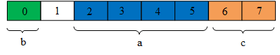
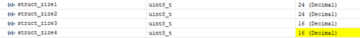
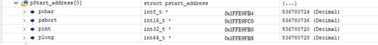
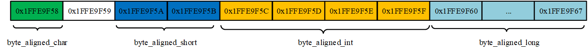
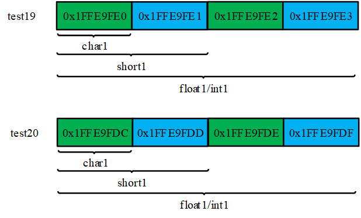

# **C语言字节对齐知识总结**

**1.**   **什么是字节对齐**

对齐，即各种类型的数据按照一定的规则在存储空间上排列，而不是按照顺序排放，这就是对齐；计算机内存空间都是按照字节划分的，因此对齐是以字节为单位进行的。

所以，不同类型的数据以字节为单位，按照一定的规则在存储空间内进行排列，为字节对齐。

**2.**   **字节对齐的作用和原因**

CPU一次处理的数据长度是按照其位数进行的，以32位CPU为例，其一次性可以处理32位数据，即4个字节。

以int型数据 a 为例，若其起始地址address_start是4的整倍数，则可认为进行了字节对齐，其数据都落在CPU一次读取的区间内，那么CPU仅需读取一次就可以完成对a的访问；若字节未对齐，CPU就需要读取两次才能把a的数据取出，还需对两次的数据进行组合才能得到a。

 

因此，字节对齐可以减少CPU访问内存的时间，提高运行效率。虽然字节对齐会浪费一些内存空间，但空间上的浪费可以减少访问内存的时间，是一种典型的以空间换时间提高效率的方法。

此外，某些硬件平台也只支持在某些地址处取某些特定类型的数据，否则会报出硬件异常。

综上，字节对齐的原因如下：

**平台原因：** 不是所有的硬件平台都能访问任意地址上的任意数据；某些硬件平台只能在某些地址处取某些特定类型的数据。

**性能原因：** 数据结构应该尽可能地在自然边界上对齐，为了访问未对齐的内存，处理器需要作两次内存访问；而对齐的内存访问仅需要一次访问。

**3.**   **字节对齐的原则**

3.1     数据类型自身对齐值：

其自身对齐值即为其所占字节大小。

3.2     结构体或类自身对齐值：

其成员中自身对齐值最大的那个值。

3.3     指定对齐值：

使用#pragma pack (value)命令指定时value的值。

3.4     有效对齐值：

指定对齐值和自身对齐值两者之间的最小值。

有效对齐值N是最终用来决定数据存放地址方式的值，有效对齐N，就是表示“对齐在N上”，也就是说该数据的存放起始地址必须能整除N，即Address_Start % N == 0。

对于单个数据类型而言，其有效对齐值即为指定对齐值和自身对齐值两者之间的最小值。

然而，数据结构中的数据变量都是按定义的先后顺序来排放的，不同的排放顺序可能占用的内存空间大小也不相同，为确定数据结构所占用的空间大小，需先确定有效对齐值N的值。

**举例1：**

**struct A**

 **{**

   **int a;**

   **char b;**

   **short c;**

 **};**

如结构体A，在GCC编译器下，其指定对齐值为默认值4，假设其起始地址为0，那么其内存分布情况如下

a的有效对齐值为4，起始地址为0，满足Address_Start % 4 == 0， 存放地址为0~3；b的有效对齐值为1，可以存放在任意地址，存放地址为4；c的有效对齐值为2，必须满足Address_Start % 2 == 0，所以，5空着，c的存放地址为6~7。最后，结构体A的有效对齐值为4，下一个结构体起始地址也满足Address_Start % 4 == 0，所以无需补充字节，结构体A占用总空间为8个字节。

**举例2：**

**struct B**

 **{**

   **char b;**

   **int a;**

   **short c;**

 **};**

若调换a、b定义顺序，如结构体B，其指定对齐值为默认值4，假设其起始地址为0，那么其内存分布情况如下

b的有效对齐值为1，可以存放在任意地址，存放地址为0；a的有效对齐值为4，起始存放地址必须满足Address_Start % 4 == 0，地址1~3需要补充，存放起始地址为4；c的有效对齐值为2，起始地址8满足Address_Start % 2 == 0，存放地址为8~9。最后，结构体B的有效对齐值为4，下一个结构体起始地址也满足Address_Start % 4 == 0，所以需补充2个字节，存放地址为10~11，结构体B占用总空间为12个字节。

**举例3：**

**#pragma pack (2)  //指定按2字节对齐**

**struct C**

 **{**

   **char b;**

   **int a;**

   **short c;**

 **};**

 **#pragma pack ()  //取消指定对齐，恢复缺省对齐**

若按照指定对齐值对齐，指定对齐值为2，如结构体C，假设其起始地址为0，那么其内存分布情况如下

b的有效对齐值为1，可以存放在任意地址，存放地址为0；a的有效对齐值为2，起始存放地址必须满足Address_Start % 2 == 0，地址1需要补充，存放地址为2~5；c的有效对齐值为2，起始地址6满足Address_Start % 2 == 0，存放地址为6~7。最后，结构体B的有效对齐值为2，下一个结构体起始地址为8，满足Address_Start % 2 == 0，所以无需补充字节，结构体C占用总空间为8个字节。

**4.**   **设置对齐值**

**4.1**   **#pragma pack(value)**

在编码时，我们可以这样动态修改编译器的对齐值：

1）修改默认对齐值，指定新的内存对齐值：#pragma pack(value)

以value和自身对齐值较小者为有效对齐值

2）取消指定的内存对齐值，恢复默认对齐值：#pragma pack()

**4.2**  **__attribute__ ((aligned(value))**

当用指定长度时，强制按照此值为结构体的有效对齐值

**4.3**  **__attribute__ ((packed))**

取消结构在编译过程中的优化对齐，按照1字节数进行对齐。此时，结构体的长度就是各个变量长度的和。

4.4  若pragma pack和__attribute__ 同时指定，则以__attribute__为准

**5.**   **基于****GCC ARM 32bit** **平台下的字节对齐测试**

**5.1**  **结构体测试**

**5.1.1**      **默认对齐值(4)**

在平台默认指定对齐值条件下，结构体成员大小未大于4，那么指定对齐值保持为默认值4，在此种情况下进行不同的排序测试。

    

 

结构体大小

结构体起始地址

test9~test12的自身对齐值为4，平台默认指定对齐值也为4，所以test9~test12有效对齐值为4，其起始地址必定满足Address_Start % 4 == 0，内部成员的有效对齐值为min(sizeof(member)，4)。

对于test9，结构体起始地址需要满足Address_Start % 4== 0，int32_t起始地址也需满足Address_Start % 4== 0，其地址范围为0x1FFE9F10 ~ 0x1FFE9F13；int8_t起始地址可以为任意地址，这里为0x1FFE9F14；float的起始地址需要满足Address_Start % 4 == 0，所以需要补充3个字节，其地址范围为0x1FFE9F18 ~ 0x1FFE9F1B；int16_t的起始地址需要满足Address_Start % 2 == 0，这里无需补充字节，其地址范围为0x1FFE9F1C ~ 0x1FFE9F1D。最后，由于test1结构体有效对齐值为4，为保证结构体内存大小必须是结构体有效对齐值的整数倍、需要补充2个字节。至此，test9结构体总大小为16个字节。

对于test10，其内存分布情况如下，分析方法同test9。

对于test11，其内存分布情况如下，分析方法同test9。

对于test12，其内存分布情况如下，分析方法同test9。

由测试结果可知，理论分析与实测结果对应，结构体内若按照成员大小事先进行排序(从小到大或从大到小)，那么结构体所占用的内存明显偏小，不仅美观，还可以节省存储空间。

**5.1.2**      **默认对齐值4情况下，但结构体包含64位数据成员**

在平台默认指定对齐值下，若结构体成员包含8个字节的成员，那么指定对齐值将被编译器修改为8，在此种情况下进行不同的排序和测试。

    

 

结构体大小

 

结构体起始地址

虽然系统默认指定对齐值为4，但test1~test4结构体包含int64_t类型数据，其指定对齐值被自动修改为8。test1~test4的自身对齐值也为8，所以test1~test4有效对齐值为8，其起始地址必定满足Address_Start % 8 == 0，内部成员有效对齐值为min(sizeof(member)，8)。

对于test1，其起始地址为0x1FFE9FB0，需满足Address_Start % 8 == 0，同时也需满足int32_t的Address_Start % 4== 0,地址范围为0x1FFE9FB0 ~ 0x1FFE9FB3；int8_t起始地址可以为任意地址，这里为0x1FFE9FB4；int64_t的起始地址需要满足Address_Start % 8 == 0，所以需要补充3个字节，其地址范围为0x1FFE9FB8 ~ 0x1FFE9FBF；int16_t的起始地址需要满足Address_Start % 2 == 0，这里无需补充字节，其地址范围为0x1FFE9FC0 ~ 0x1FFE9FC1。最后，由于test1结构体有效对齐值为8，为保证内存大小必须是结构体有效对齐值的整数倍，需要补充6个字节。至此，test1结构体总大小为24个字节。

 对于test2，其内存分布情况如下，分析方法同test1。

对于test3，其内存分布情况如下，分析方法同test1。

对于test4，其内存分布情况如下，分析方法同test1。

由测试结果可知，理论分析与实测结果对应，结构体内若包含位数为64的变量，不仅访问该变量需要两个周期，而且系统将自动设置指定对齐值为8，这样也会因有效对齐值过大而补充多余的空字节。因此，在平台应用中，应尽量避免使用超过32位的数据类型。

**5.1.3     动态设置指定对齐值**

在编程过程中动态修改指定对齐值，对同一结构体进行测试。

    

 

结构体大小

 

结构体起始地址

对于test5 ，其指定对齐值为1，结构体自身对齐值为8，结构体和内部成员的有效对齐值都为1, 任何成员起始地址都满足Address_Start % 1== 0条件，各个成员之间无需进行字节补充，test5内存大小为结构体有效对齐值1的整数倍，最后也无需进行字节补充，其内存分布情况如下:

对于test6，其指定对齐值为2，结构体自身对齐值为8，结构体有效对齐值为2，结构体起始地址必定满足Address_Start%2 == 0，内部成员除char外，都需要满足Address_Start%2==0，并且要保证test6内存大小为结构体有效对齐值2的整数倍，其内存分布情况如下:

对于test7，其指定对齐值为4，结构体自身对齐值为8，其有效对齐值为4，结构体起始地址必定满足Address_Start%4 == 0。内部成员char起始地址需满足Address_Start%1==0；成员short起始地址需满足Address_Start%2==0，成员int和long起始地址需满足Address_Start%4==0，并且最后要保证test7内存大小为结构体有效对齐值4的整数倍，其内存分布情况如下:

对于test8，其指定对齐值为8，结构体自身对齐值为8，其有效对齐值为8，结构体起始地址必定满足Address_Start%8 == 0。内部成员char起始地址需满足Address_Start%1==0；成员short起始地址需满足Address_Start%2==0，成员int起始地址需满足Address_Start%4==0，成员long起始地址需满足Address_Start%4==0，并且最后要保证test8内存大小为结构体有效对齐值8的整数倍，其内存分布情况如下:

由测试结果可知，理论分析与实测结果对应，就算同一排列顺序，若指定的对齐值不同，结构体所占空间也可能不同。

在常规应用过程中，使用平台默认的指定对齐值即可，平台会自动以此值对定义的变量进行字节对齐。然而，在通信过程中，通信双方传递消息的结构体若没有统一字节对齐，则很可能出现问题。

**5.2**    **位域测试**

位域的声明和结构体类似，但需要注意以下几点：

1、位域的成员需属于整型

2、位域的空间上是按照需要以4个字节或者1个字节的方式来开辟的。

**5.3.1**      **结构体位域为同一变量类型**

   

test13与test14结构体的自身对齐值为1，平台默认对齐值为4，因此，两者有效对齐值为1。

对于test13，char1与char2共有7位，不超过8位，两者组成一个int8_t型数据data_byte1，char1在低位，占3个bit，char2在高位占4个bit，data_byte1值应为10；而char3与char4共有9位，超过8位，两者不能组成一个字节，两者分别占用两个int8_t型数据data_byte2和data_byte3。此外，test13的有效对齐值为1，无需任何补充字节，所以占用3个字节。

 

对于test14，char1、char2和char3共有8位，不超过8位，三者组成一个int8_t型数据data_byte1，char1在低位，占3个bit，char2在中间位占4个bit，char3在最高位，占一个bit， 按照所赋初值，data_byte1值应为138；而char4为4位，不超过8位，单独组成一个字节data_byte2，两者的值分别为138和4。此外，test14的有效对齐值为1，无需任何补充字节，所以占用2个字节。

 

**5.3.2**      **结构体位域包含不同变量类型**

test15与test16结构体的自身对齐值为4，平台默认对齐值为4，因此，两者有效对齐值为4。

   

对于test15，char1与char2共有7位，不超过8位，两者组成一个int8_t型数据data_byte1，char1在低位，占3个bit，char2在高位占4个bit，data_byte1值应为10；而char3与char4共有9位，超过8位，两者不能组成一个字节，char3单独为一个字节data_byte2，值为8；char4与下一成员变量int1共同组成字节，而int1作为32位数据可以继续包含位域，所以char4、int1和int2共同组成2个字节，分别为data_byte3和data_byte4，data_byte3值应为212，data_byte4应为0。最后，由于test15的有效对齐值为4，满足内存大小必须是最大类型字节的整数倍要求，无需进行字节补充。

此种情况下，由于int1为32位数据，其可以承接上个位域和下个位域，最多组成4个字节，这里组成了2个字节。

 

对于test16，char1、char2和char3共有8位，三者组成一个字节data_byte1，char1在低位，占3个bit，char2在中间位占4个bit，char3为最高位，占1个bit，data_byte1值应为138；而char4与int1、int2，刚好组成8位，三者组成一个字节data_byte2，data_byte2值应为84，最后，由于test16的有效对齐值为4，而data_byte2的地址为0x1FFE9FD5，不满足内存大小必须是最大类型字节的整数倍要求，需进行2个字节data_byte3和data_byte4的补充，其值都为0。

 

此种情况下，由于int1为32位数据，其可以承接上个位域和下个位域，最多组成4个字节，这里组成了1个字节。

**5.3.3**      **结构体位域动态设置指定对齐值**

针对test15和test16，使用指定对齐指令时，进行位域字节对齐的测试。

   

由于指令指定对齐值为2，test17和test18的自身对齐值为4，所以两者有效对齐值为2

对于test17，char1与char2占7位，但由于指定对齐值为2，剩余1位继续由下一个位域char3的第一位填充，三者共同组成data_byte1，由所赋初值可知，data_byte1应为138；char3的第二位至第五位填充至data_byte2的前四位，char4刚好填充data_byte2的后四位，char3与char4共同组成data_byte2，由所赋初值可知，data_byte2应为64；int1与int2的前7位共同组成data_byte3，由所赋初值可知data_byte3应为13，int2的后2位组成data_byte4，由所赋初值可知data_byte4应为1。满足内存大小必须是结构体有效对齐值的整数倍要求，无需进行字节补充。

 

对于test18，char1、char2和char3三者共同组成data_byte1，由所赋初值可知，data_byte1应为138；char4又与int1和int2共同组成data_byte2，由所赋初值可知，data_byte2应为84；由于 data_byte2下一地址为0x1FFE9FD6，满足内存大小必须是结构体有效对齐值的整数倍要求，无需进行字节补充充。

 

以上两中种情况下，由于人为指定对齐值为2，不同的位域最大可以组成2个字节，而在默认指定对齐值下，不同的位域所能组成的字节数取决于组合成员中位域的类型。

**5.3**  **共用体测试**

共用体特点：

1、共用体的所有成员占用同一段内存，修改一个成员会影响其余成员。

2、共用体使用了内存覆盖技术，占用的内存等于最长的成员占用的内存。

5.3.1  默认对齐值(4)

在系统默认对齐值下，对共用体内的变量不同的定义顺序进行测试。

   

由上述测试结果可知，共用体的大小不受内部变量定义的顺序的影响，其大小始终等于内部最大成员的大小。

5.3.2      动态设置指定对齐值(4)

在编程过程中动态修改指定对齐值，对同一共用体进行测试。

   

由上述测试结果可知，共用体的大小也不受指定对齐值设置指令的影响，其大小始终等于内部最大成员的大小。

**6.**   **总结**

**6.1**  **结构体**

1、在定义结构体时，应注意相同作用的变量定义在一起，再考虑字节对齐，按照从小到大的顺序定义成员变量

2、结构体的成员中，尽量避免使用超过32位的变量

3、尽量使用平台默认的指定对齐值，平台会自动以此值对定义的变量进行字节对齐，涉及到通信或特殊平台时才考虑设置指定对齐值。

**6.2**  **位域**

1、由于位域的对齐规则各个平台差别较大，在定义结构体位域时，尽量使用与平台相对得变量定义位域，如32位平台就尽量使用uint32_t类型定义。

2、在定义结构体位域时，尽量不要定义不同数据类型的位域或者动态指定对齐值，这样会导致同一位域分布在多个字节上，不利于数据的分析。

3、在定义结构体位域时，尽量按照所需要的位数确定位域的长度。

**6.3**  **共用体**

1、在定义共用体时，成员变量的定义顺序和动态设置的指定对齐值都不会影响共用体大小。

 